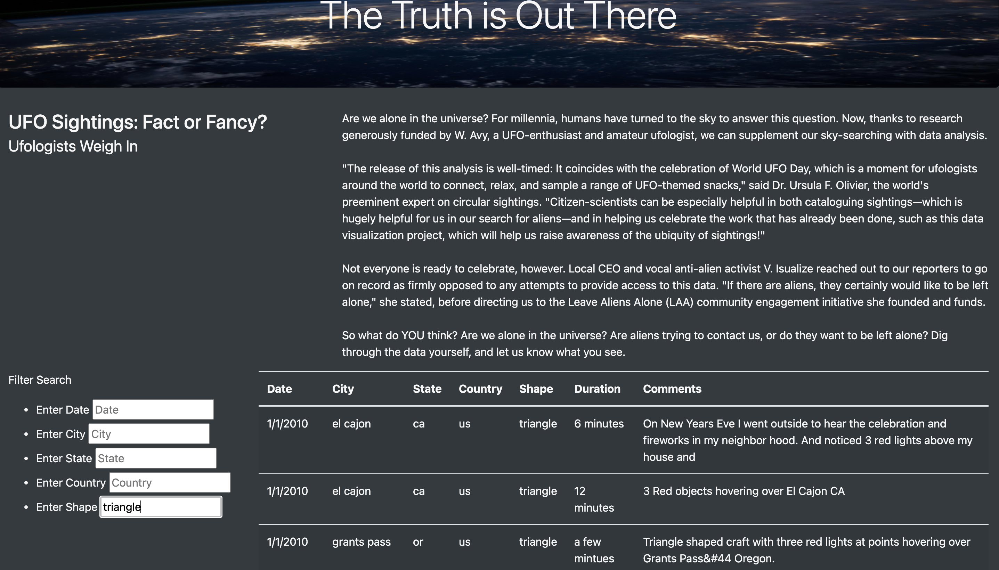

# UFOs
UFO Sighting Analysis Project for UT Austin Data Analysis Bootcamp  

## Project Overview
We were asked to build a webpage that would display a table with data regarding UFO sightings. We were then asked to build a dashboard that would allow a user to input search criteria and use JavaScript code to filter the data according to the user's demands.  

## Resources
- Data Sources: data.js
- Software: JavaScript, HTML, CSS, VS Code

## Results
We began by building the webpage with HTML. We used Bootstrap and a CSS style sheet to format the page, breaking it into divisions and creating a header and navbar. We then built an empty table. We populated this table with data from a list in the data.js document. Using a `forEach` loop we iterated through data.js and pushed the values into their respective locations in the table. Lastly, we created a series of filters that would allow the user to refine the data. We wrote the following code to tell the website to listen until a filter was changed, then update the filters and rebuild the table accordingly: `d3.selectAll("input").on("change", updateFilters);`  
#### - Website Layout

The design of the website can be seen below, showing empty input boxes where a user may filter the table. All the user need do is type something into any number of input boxes. Once they press Return or move to another box the table will be filtered. 

 

 

 

#### - Filtering the data

In order to filter the data we first wrote a function to create an object to hold all of the filters a user might input. We created variables elementValue and filterId based on the user's input, then created from that an array, filters, which held a set of key:value pairs. We then ran a separate filterTable() function to narrow the results table. We used a forEach loop in combination with the Object.keys() method to loop through the filters array and compare it against the data in data.js. The image below shows the table after having been filtered for triangle-shaped UFOs. 

 

 

 

## Summary

One drawback of this webpage is that a user must enter their input data exactly as it appears in the data.js document, otherwise it will not be displayed after filtering. The UFO shapes would be difficult to filter for since they are dependent on subjective descriptions by the observers. 

One thing that might improve the website would be to use drop-down menus to filter, rather than typed input. This would reduce possibility for user error and make the user aware of options they might not have known about otherwise. 

In order to develop the sight further we could perform statistical analysis on the data. More than just displaying a table of data, we could map the sightings and create heatmaps of sighting frequency by location. In addition, we could analyze the frequency of sightings over time to give us additional insights into the nature of UFO sightings.

